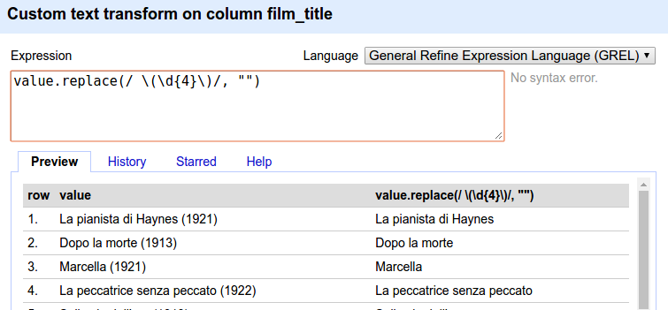
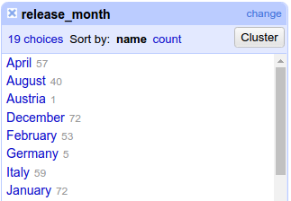

# Workflow

Here I'll record my process acquiring and (in future) working with these data.

## Data scraping

I started with a 'seed file', `data/diva_ids.csv`, in which I manually entered the names of the actresses to be targeted and their IMDb IDs. I kept my dataset of actresses small: basically, just the most well-known.

This CSV was fed into the script `get_film_ids.py`. The script scrapes each actress' IMDb page and returns the IMDb IDs for all of the titles in her filmography. These lists of films are added to the existing data, and everything is written out to a new CSV, `diva_film_ids.csv`.

This new CSV is the input for the script `get_film_data.py`. The first thing that script does is to collate a list of all the film IDs listed in the CSV, removing any double-ups. This gave me a corpus of **793** (!) films.  
Each film's data are scraped from IMDb. For example:

```
{
    'film_title': 'La verità nuda (1921)',
    'film_year': '1921',
    'production_country': 'Italy'
    'director': 'nm1302092',
    'release_month': 'April',
    'release_year': '1921',
    'release_location': 'Italy',
    'production_company': 'Rinascimento Film',
    'cast': 'nm0538729, nm0579618, nm0667546',
    'imdb_id': 'tt0963359',
}
```

Then collectively, the film information is written out to a new CSV, `diva_film_data.csv`. Each film's data form one row of the CSV.

IMDb is a pretty messy website, so the scraping was quite a pain. But I got there in the end.

As shown above, the film titles also included the year in brackets, so I just zapped those after the fact with OpenRefine.  



I also did a bit of other light data cleaning, since I accidentally picked up some unexpected text strings, for example in the `release_month` field. (I think this was because for those particular films, no release month was specified).



For Italian films that were produced in the silent era (<= 1930), I added the city of production (via the location of the production company), checking against publications where necessary.

Separately, I also produced a version of the CSV containing only silent-era films (<= 1930; a total of **709** films). This just done quickly in OpenRefine.

In this dataset, personnel are represented by their IMDb ID, not their name. So, I also needed to get the name corresponding to the IMDb ID. I did this using the script `get_names_from_ids.py`.

Firstly, the script collates the directors listed in `diva_film_data.csv` and scrapes each one's name from their IMDb page. The names and IDs are then written out to a new file, `director_names.csv`. **195** separate director names were retrieved in this way.  
(I also went and added a column for gender to the output CSV, in case it will be useful in future. I set male as the default value and went through the list, changing to female as appropriate - only a handful of cases).

The `get_names_from_ids.py` script also does the same for the actors: it pulls out all of the actor IDs listed in `diva_film_data.csv`, collates them, removes duplicate entries, and hits their IMDb page to scrape their name. When all of the names have been retrieved, the names and IDs are written out to `actor_names.csv`. A truly insane **3046** (!!!) separate actor names were retrieved in this way.
